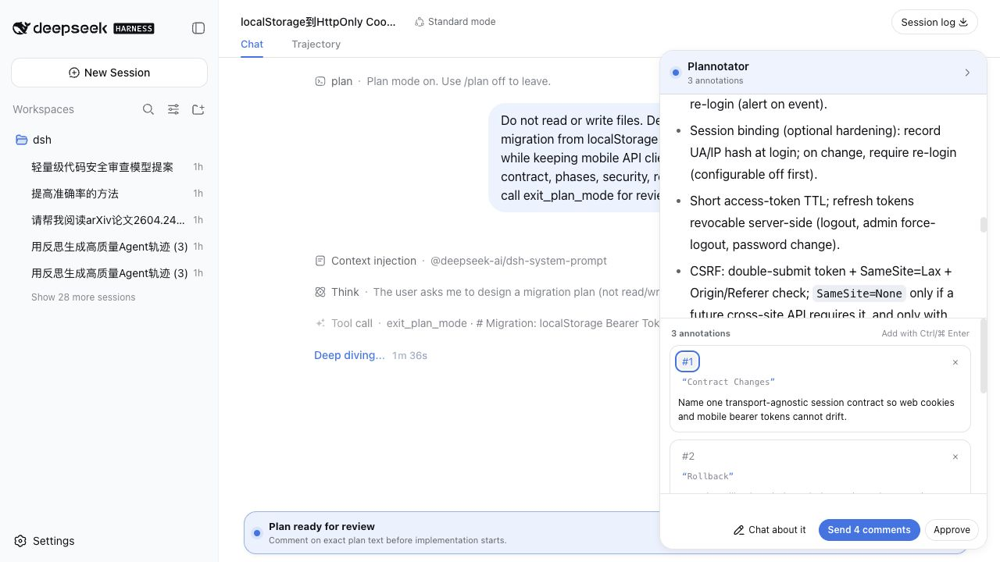
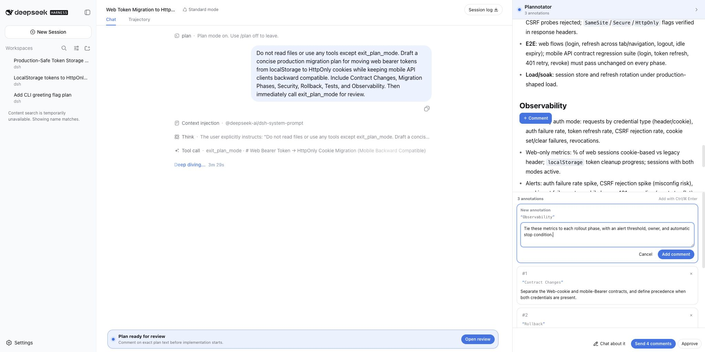
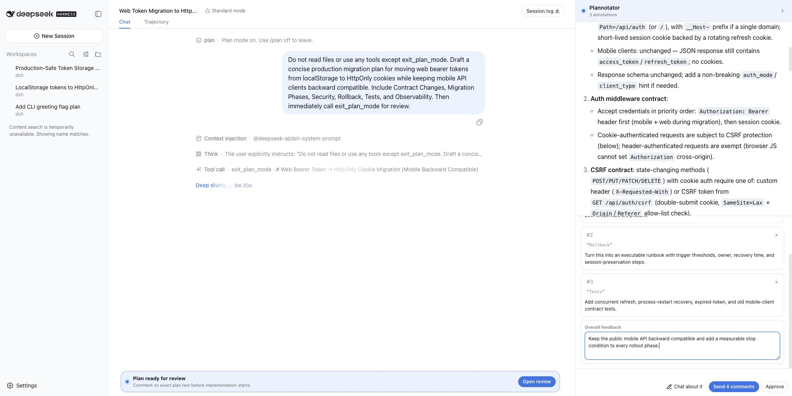
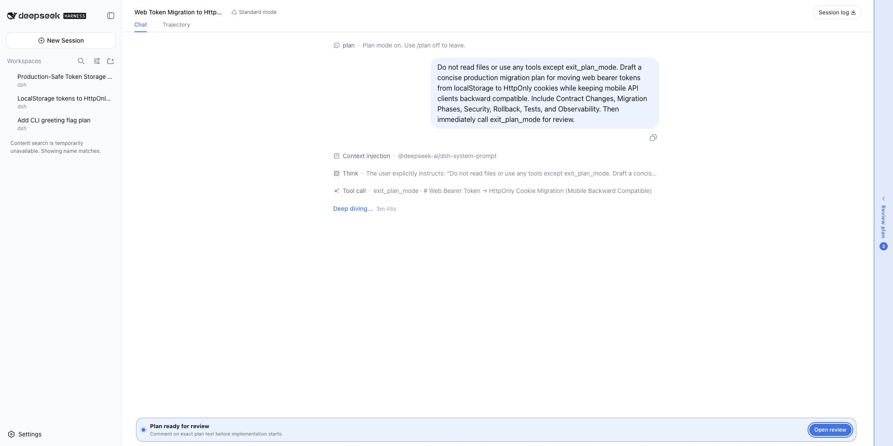
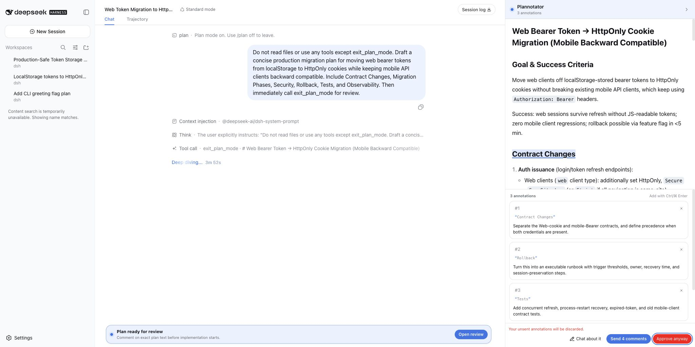

<div align="center">

# 📝 dsh-plannotator

### *Review the plan before your coding agent writes the code.*

[](https://github.com/deepseek-ai)
[](#features)
[](LICENSE)

<br>

<table align="center">
<tr>
<td align="left">
① The plan sounds plausible, but one sentence hides a migration risk?<br>
② You found several independent problems, but the only choices are Approve or Reject?<br>
③ You want every comment to stay attached to the exact text the agent must revise?
</td>
</tr>
</table>

### ✨ Turn a binary plan gate into a precise, multi-comment review.

Select exact plan text, collect precise comments, and return one structured review—without leaving DeepSeek Harness.

[Why it exists](#why-dsh-plannotator) · [Features](#features) · [Install](#install) · [How it works](#how-it-works)

**English** · [简体中文](README.zh-CN.md)


</div>

---



> “Change the third step” is vague. A comment attached to the exact sentence
> preserves the context the agent needs to revise the plan correctly.

**Select exact text → comment on several risks → send one review → approve when ready.**

---

<a id="why-dsh-plannotator"></a>

## 🎯 Why dsh-plannotator

Coding agents are good at producing plans, but a binary **Approve / Reject**
decision is too coarse for serious work. Architecture migrations, API changes,
security fixes, and rollout plans often need several independent corrections
before implementation begins.

`dsh-plannotator` turns DSH's native Plan Review into a compact gate plus a
responsive companion panel. On a wide screen, the conversation and review
occupy separate columns, so opening the panel never covers chat text. Collapse
it to a slim edge rail and reopen it without settling the request. Your comments
still travel through DSH's existing response flow as structured Markdown, so the
agent can revise the proposal in plan mode and ask for review again.

This is an unofficial integration inspired by
[Plannotator](https://github.com/backnotprop/plannotator).

---

<a id="features"></a>

## 🧰 Features

### Comment on the exact claim—not “somewhere in the plan”

Drag over text for a precise annotation, or double-click a paragraph, list
item, heading, bold phrase, or code fragment. The review keeps the quote and
comment together within the current plan revision.



### Review the whole plan in one pass

Collect multiple comments across compatibility, security, rollback, and tests;
add overall feedback; click an annotation in the review panel to return to its
source; then send one coherent review. This keeps the review compact and less
ambiguous than a sequence of detached chat messages.



### Collapse the review without losing your place

The review panel can shrink to a blue edge rail while the compact composer gate
remains visible. Reopen either control to continue with the same comments and
overall feedback.



### Return actionable feedback to the agent

**Send feedback** answers the real `exit_plan_mode` interaction. DSH records the
quoted plan text, each requested change, and the overall feedback in the tool
result and Session Log. The agent remains in plan mode and can immediately
produce a revised proposal.

### Ask AI about the plan

Select plan text and choose **✦ Ask AI** (or open the **Ask AI** tab directly
for a general question). The question travels with the plan text, the quoted
excerpt, and your earlier Q&A to a one-shot subagent of the reviewed session —
same model, same workspace — that can inspect the repository with read-only
tools (`read`, `grep`, `glob`, `web_search`, `web_fetch`, probed against the
session's actual tool set). The answer renders inline as Markdown; follow-up
questions keep the thread's context, and **Stop** cancels a slow answer. The
answering child never modifies files, never rewrites the plan, and cannot
delegate further.

### Protect unfinished reviews

Unsent comments are saved locally in the browser, isolated by Session, pending
request, and plan revision. If you try to approve while feedback is still
pending, the plugin requires an explicit second confirmation instead of
silently discarding your work.



| Capability | What you get |
| --- | --- |
| Precise annotations | Text selection plus a reliable double-click block fallback |
| Multi-comment review | Anchored comments, source navigation, deletion, and overall feedback |
| Responsive review column | Side-by-side on wide screens, an on-demand drawer on narrower desktops, and a bottom sheet on phones |
| DSH response loop | Approve, request changes, or return to chat through the existing pending interaction |
| Ask AI | Plan Q&A by a one-shot read-only subagent, with quoted excerpts, follow-ups, and cancellation |
| Draft recovery | Best-effort local recovery without a plugin server or third-party service |
| Review safeguards | Stale-plan draft rejection and explicit confirmation before discarding feedback |
| UI fit | English and Chinese copy, keyboard shortcuts, responsive layout, and DSH theme tokens |

---

<a id="install"></a>

## 📦 Install

Install the GitHub bundle into the DSH Web profile, then restart `dsh web`:

```bash
dsh plugin --profile web add github:titanwings/dsh-plannotator#v0.1.4
```

The repository ships its built Host and Web bundles, so installation runs no
package build script and needs no `allowBuilds` entry. Pin a reviewed commit SHA
instead of the release tag when you need an exact source revision.

<details>
<summary>Install from a local checkout</summary>

Use Node.js 22.19+:

```bash
pnpm install
pnpm check

cd /path/to/deepseek-harness
pnpm dsh plugin --profile web add /path/to/dsh-plannotator
```

Restart `dsh web` after changing the installed Client plugin set.

</details>

---

<a id="how-it-works"></a>

## 🔄 How it works

1. Ask the coding agent to create a plan in DSH Plan mode.
2. When `exit_plan_mode` reaches Plan Review, DSH shows a compact gate. On wide
   screens the review opens beside the conversation; narrower screens keep it
   closed until you choose **Open review**.
3. Select the exact text that needs work. Collapse and reopen the panel at any
   time without settling the review.
4. Add as many targeted comments as necessary, plus optional overall feedback.
5. Choose **Send feedback**. The agent receives one structured review and stays
   in plan mode.
6. Review the revision and choose **Approve** when it is ready to implement.

**Chat about it** dismisses the gate and returns to the ordinary composer.
Removing the plugin restores DSH's built-in Plan Review automatically.

### Built for real coding plans

The screenshots above use a production-style authentication migration example,
not placeholder copy. The same workflow is useful whenever several plan details
must be correct before the first edit:

| Plan | Useful review comments |
| --- | --- |
| Database or auth migration | Compatibility window, idempotent migration, rollback threshold, zero-downtime sequencing |
| Public API refactor | Contract preservation, deprecation path, versioning, mobile or SDK compatibility |
| Security change | Trust boundaries, CSRF and secret handling, audit evidence, failure behavior |
| Deployment rollout | Feature-flag phases, observable stop conditions, owners, rollback rehearsal |
| Test strategy | Missing failure cases, concurrency, restart recovery, regression and acceptance criteria |

---

## 🧩 Compatibility and boundaries

- Designed for the DeepSeek Harness **Web** client and Node.js 22.19+.
- Claims only a valid, single-question DSH `plan-review` interaction. Other
  questions fall through to the built-in renderer.
- Reviews Markdown plans; it is not a general document editor, Git diff viewer,
  PR publisher, file tree, or the full standalone Plannotator SPA.
- Drafts live in the current browser's local storage. They are not cloud-synced
  and are intentionally rejected when the plan revision changes.
- At 1480px and above, the plugin reserves a 440–560px companion column beside
  DSH, so the panel and conversation never overlap. Narrower desktops use an
  on-demand drawer; phones use a compact bottom sheet.
- The companion panel is plugin-owned, not DSH's core `details` panel. It uses
  the stable Web `#root` mount boundary to reserve space and lets AppFrame
  reflow normally; it does not register in or rewrite the core details grid.
- The Ask AI channel is a loopback/trusted-host RPC channel (`/dsh-plannotator`)
  on DSH's shared Connection transport. Each question runs as a one-shot
  subagent (labelled `plan-ask`, visible in the session's subagent list) that
  inherits the reviewed session's model and composition under a read-only tool
  filter. Answers are unary (no streaming yet), and the Q&A thread lives only
  in the open panel — it is not persisted like annotation drafts.
- Feedback travels through DSH's existing response channel. No third-party
  service or telemetry is used.

<details>
<summary>How it fits DSH's Cordis architecture</summary>

The bundle inserts one Cordis Loader row. Its Host entry registers only the
Ask AI RPC channel on the shared Connection transport; `package.json#dsh.client`
exposes the Web bundle. The Client registers its locale namespace and a
`conversation.composer` chain entry at priority `-10`, ahead of the default
question renderer, and selects only Plan Review requests. That contribution
renders the compact gate and mounts the plugin-owned panel through a React
portal. Wide layouts reserve matching space at the stable Web root; narrower
layouts reuse the panel as an on-demand drawer or bottom sheet.

There is no DSH core patch, parallel agent loop, duplicate persistence layer,
or custom scheduler. Unloading the Cordis row removes the slot contribution and
reveals the built-in UI again.

</details>

---

## 🛠️ Development

```bash
pnpm typecheck
pnpm test
pnpm build
```

The browser bundle follows DSH's `window.__ModuleLoader__` contract and treats
React, ReactDOM, and DSH UI primitives as platform modules, preserving one React
runtime.
