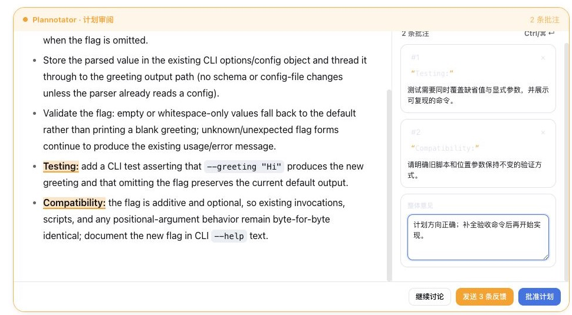

# dsh-plannotator

An unofficial, native DeepSeek Harness integration inspired by
[Plannotator](https://github.com/backnotprop/plannotator).

`dsh-plannotator` upgrades DSH's existing plan approval card into an
annotation workspace. Select text in a Markdown plan, attach precise comments,
add overall feedback, and return the complete review to the coding agent in one
action.

It is not an iframe, a screenshot mock, or a second agent loop. The plugin
answers DSH's real `exit_plan_mode` pending interaction:

- **Approve** uses the asker's exact approval option and exits plan mode.
- **Send feedback** returns a custom structured answer, keeps plan mode active,
  and records the feedback in the tool result and Session Log.
- **Chat about it** dismisses the gate and restores the ordinary composer.

Removing the plugin restores DSH's built-in Plan Review UI automatically.

## Screenshot



## Scope

Version 0.1 intentionally implements only the high-value Plan Review loop:

- rendered Markdown plan
- precise text-selection annotations plus a double-click block fallback
- stable quote/context anchors for the lifetime of a review
- annotation sidebar and overall feedback
- draft recovery in browser storage, scoped by Session and pending request
- explicit confirmation before approving with unsent comments
- native DSH response, logging, replay, and unload behavior

It does **not** duplicate Git trees, commit diffs, PR publishing, file editing,
or Plannotator's full standalone SPA. Those surfaces already have stronger
owners in the DSH ecosystem and are not needed to make plan feedback useful.

## Install from this checkout

Use Node.js 22.19+:

```bash
pnpm install
pnpm check

cd /path/to/deepseek-harness
pnpm dsh plugin --profile web add /path/to/dsh-plannotator
```

Restart `dsh web` after changing the installed Client plugin set.

## Install from GitHub

Pin a reviewed commit because a Git dependency's `prepare` script runs on the
host during installation:

```bash
dsh plugin --profile web add github:dsh-external/dsh-plannotator#<commit-sha>
```

pnpm 10+ may require an explicit `allowBuilds` entry for
`@dsh-external/dsh-plannotator` before it runs the Git package's build.

## Architecture

The bundle inserts one Cordis Loader row. Its Host entry is deliberately a
no-op; `package.json#dsh.client` exposes the Web bundle. The Client registers a
`conversation.composer` chain entry at priority `-10` and claims only a valid
single-question `plan-review` request. Every other question falls through to
the built-in DSH renderer.

No DSH core patch, custom HTTP route, external service, telemetry, or network
request is used.

## Development

```bash
pnpm typecheck
pnpm test
pnpm build
```

The browser bundle follows DSH's `window.__ModuleLoader__` contract and treats
React and DSH UI primitives as platform modules, preserving one React runtime.

## Attribution

This project is an unofficial integration and is not endorsed by the
Plannotator maintainers. Its interaction model is inspired by Plannotator,
which is available under MIT or Apache-2.0. See
[THIRD_PARTY_NOTICES.md](THIRD_PARTY_NOTICES.md) and
[LICENSES/Plannotator-MIT.txt](LICENSES/Plannotator-MIT.txt).
