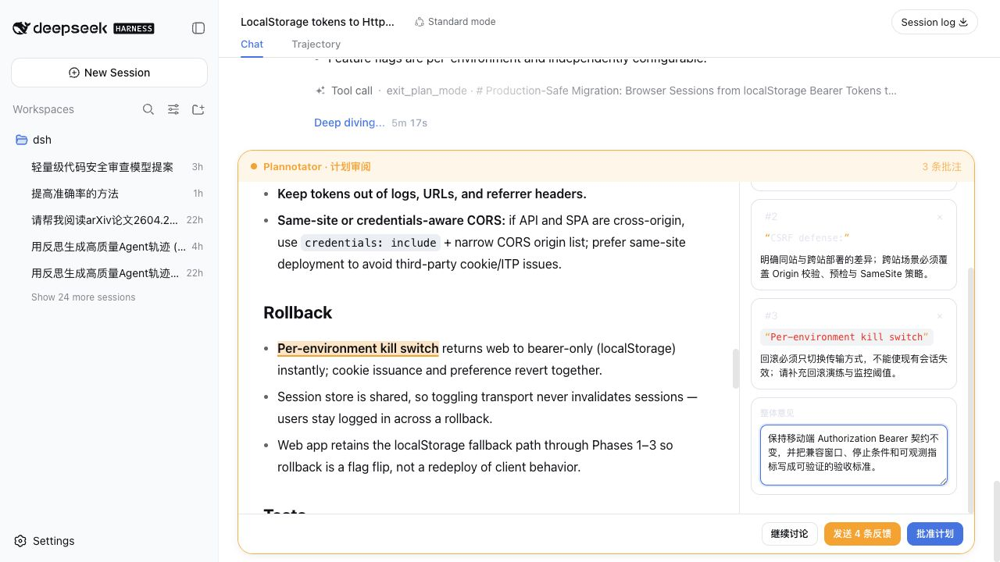
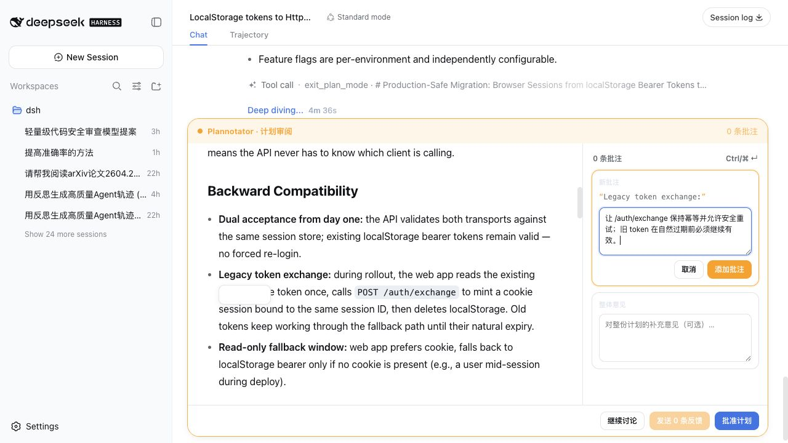
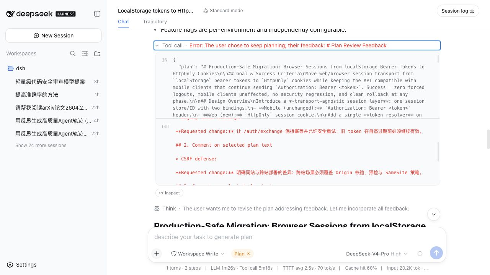
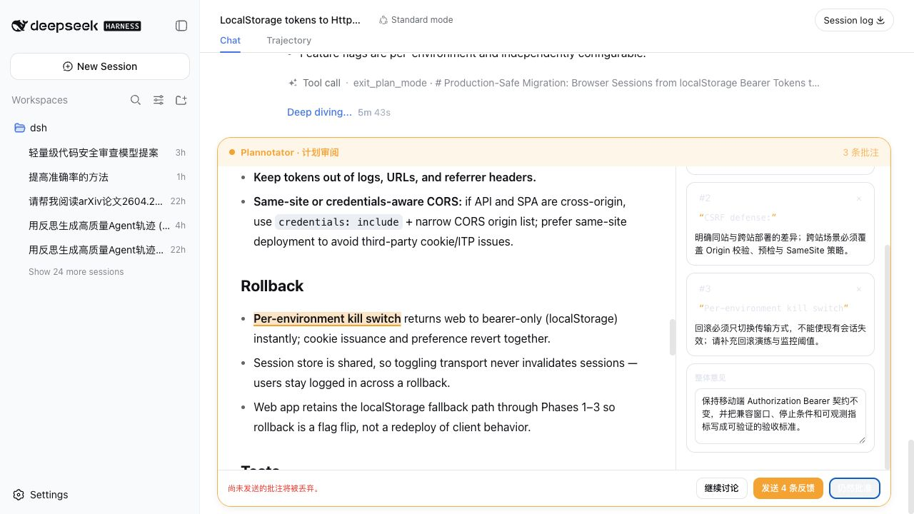

# dsh-plannotator

<div align="center">

### Review the plan before your coding agent writes the code.

Select exact plan text, attach precise comments, and return one structured
review to the agent—without leaving DeepSeek Harness.

[](https://github.com/dsh2026/test-titanwings)
[](#features)
[](LICENSE)

**English** · [简体中文](README.zh-CN.md)

[Why it exists](#why-dsh-plannotator) · [Features](#features) · [Install](#install)

</div>



> “Change the third step” is vague. A comment attached to the exact sentence
> preserves the context the agent needs to revise the plan correctly.

**Select exact text → comment on several risks → send one review → approve when ready.**

## Why dsh-plannotator

Coding agents are good at producing plans, but a binary **Approve / Reject**
decision is too coarse for serious work. Architecture migrations, API changes,
security fixes, and rollout plans often need several independent corrections
before implementation begins.

`dsh-plannotator` turns DSH's native Plan Review into a focused annotation
workspace. Your comments stay attached to the plan statements they refer to,
then travel back through DSH's existing response flow as structured Markdown.
The agent stays in plan mode, revises the proposal, and asks for review again.

This is an unofficial integration inspired by
[Plannotator](https://github.com/backnotprop/plannotator).

## Features

### Comment on the exact claim—not “somewhere in the plan”

Drag over text for a precise annotation, or double-click a paragraph, list
item, heading, bold phrase, or code fragment. The review keeps the quote and
comment together within the current plan revision.



### Review the whole plan in one pass

Collect multiple comments across compatibility, security, rollback, and tests;
add overall feedback; jump between annotations from the sidebar; then send one
coherent review. This is much faster and less ambiguous than a sequence of chat
messages.


### Return actionable feedback to the agent

**Send feedback** answers the real `exit_plan_mode` interaction. DSH records the
quoted plan text, each requested change, and the overall feedback in the tool
result and Session Log. The agent remains in plan mode and can immediately
produce a revised proposal.



### Protect unfinished reviews

Unsent comments are saved locally in the browser, isolated by Session, pending
request, and plan revision. If you try to approve while feedback is still
pending, the plugin requires an explicit second confirmation instead of
silently discarding your work.



| Capability | What you get |
| --- | --- |
| Precise annotations | Text selection plus a reliable double-click block fallback |
| Multi-comment review | Anchored comments, sidebar navigation, deletion, and overall feedback |
| Native DSH loop | Approve, request changes, or return to chat through the existing pending interaction |
| Draft recovery | Best-effort local recovery without a plugin server or third-party service |
| Review safeguards | Stale-plan draft rejection and explicit confirmation before discarding feedback |
| UI fit | English and Chinese copy, keyboard shortcuts, responsive layout, and DSH theme tokens |

## Built for real coding plans

The screenshots above use a production authentication migration, not placeholder
copy. The same workflow is useful whenever several plan details must be correct
before the first edit:

| Plan | Useful review comments |
| --- | --- |
| Database or auth migration | Compatibility window, idempotent migration, rollback threshold, zero-downtime sequencing |
| Public API refactor | Contract preservation, deprecation path, versioning, mobile or SDK compatibility |
| Security change | Trust boundaries, CSRF and secret handling, audit evidence, failure behavior |
| Deployment rollout | Feature-flag phases, observable stop conditions, owners, rollback rehearsal |
| Test strategy | Missing failure cases, concurrency, restart recovery, regression and acceptance criteria |

## How it works

1. Ask the coding agent to create a plan in DSH Plan mode.
2. When `exit_plan_mode` opens Plan Review, select the exact text that needs work.
3. Add as many targeted comments as necessary, plus optional overall feedback.
4. Choose **Send feedback**. The agent receives one structured review and stays
   in plan mode.
5. Review the revision and choose **Approve** when it is ready to implement.

**Chat about it** dismisses the gate and returns to the ordinary composer.
Removing the plugin restores DSH's built-in Plan Review automatically.

## Install

Install the GitHub bundle into the DSH Web profile, then restart `dsh web`:

```bash
dsh plugin --profile web add github:dsh-external/dsh-plannotator#main
```

For a repeatable installation, replace `main` with a reviewed commit SHA.
Git-based dependencies run their `prepare` script on the host; pnpm 10+ may
require an `allowBuilds` entry for `@dsh-external/dsh-plannotator`.

<details>
<summary>Install from a local checkout</summary>

Use Node.js 22.19+:

```bash
pnpm install
pnpm check

cd /path/to/deepseek-harness
pnpm dsh plugin --profile web add /path/to/dsh-plannotator
```

Restart `dsh web` after changing the installed Client plugin set.

</details>

## Compatibility and boundaries

- Designed for the DeepSeek Harness **Web** client and Node.js 22.19+.
- Claims only a valid, single-question DSH `plan-review` interaction. Other
  questions fall through to the built-in renderer.
- Reviews Markdown plans; it is not a general document editor, Git diff viewer,
  PR publisher, file tree, or the full standalone Plannotator SPA.
- Drafts live in the current browser's local storage. They are not cloud-synced
  and are intentionally rejected when the plan revision changes.
- No custom Host route, third-party service, or telemetry is used. Feedback
  travels through DSH's existing response channel.

<details>
<summary>How it fits DSH's Cordis architecture</summary>

The bundle inserts one Cordis Loader row. Its Host entry is deliberately a
no-op; `package.json#dsh.client` exposes the Web bundle. The Client registers a
`conversation.composer` chain entry at priority `-10`, ahead of the default
question renderer, and selects only Plan Review requests.

There is no DSH core patch, parallel agent loop, duplicate persistence layer,
or custom scheduler. Unloading the Cordis row removes the slot contribution and
reveals the built-in UI again.

</details>

## Development

```bash
pnpm typecheck
pnpm test
pnpm build
```

The browser bundle follows DSH's `window.__ModuleLoader__` contract and treats
React and DSH UI primitives as platform modules, preserving one React runtime.

## Attribution

This project is an unofficial integration and is not endorsed by the
Plannotator maintainers. Its interaction model is inspired by Plannotator,
which is available under MIT or Apache-2.0. See
[THIRD_PARTY_NOTICES.md](THIRD_PARTY_NOTICES.md) and
[LICENSES/Plannotator-MIT.txt](LICENSES/Plannotator-MIT.txt).
